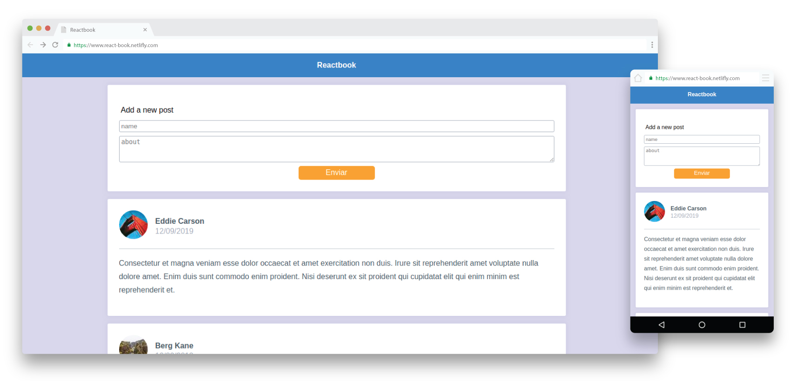

<h1 align="center">
  <a href="https://react-book.netlify.com">
    reactbook
  </a>
</h1>



<p align="center">
  <a href="https://travis-ci.org/luizclr/react-book">
    
  </a>
  <a href="https://github.com/prettier/prettier">
    
  </a>
  <a href="https://app.netlify.com/sites/react-book/deploys">
    
  </a>
  <a href="https://coveralls.io/github/luizclr/react-book?branch=master">
    
  </a>
</p>

---

<h2 align="center">🚧 work in progress...</h2>

## Table of Contents

- [Requirements](#requirements)
- [Configs](#configs)
- [Running](#running)
  - [Local API](#local-api)
  - [Application](#application)
- [Coding style](#coding-style)
- [Testing](#testing)
- [Build](#build)
- [License](#license)

## Requirements

- nodejs >= 10.16.3
- yarn >= 1.9.0

## Configs

Copy the `db.example.json` file in `__fake-baskend__` folder and rename it to `db.json`.

## Running

```bash
# Install packages
yarn install
```

### Local API

```bash
yarn run fake-backend
```

Server will start on [localhost:3000](http://localhost:3000).

### Application

```bash
# Start server locally
yarn start
```

Application will be opened automatically on [localhost:8080](http://localhost:8080).

## Coding style

```bash
# Linter
yarn run lint
```

## Testing

```bash
# run teste
yarn run test
# test coverage
yarn run test:coverage
# watch changes
yarn run test:watch
```

## Build

```bash
# Build for production
yarn run buld
```

## License

This project is licensed under the MIT License - see the [LICENSE](LICENSE) file for details.
